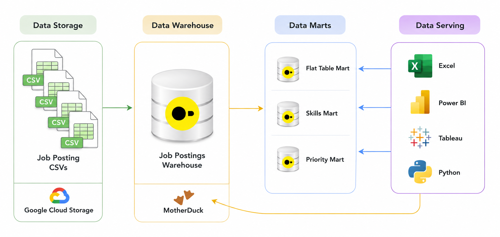
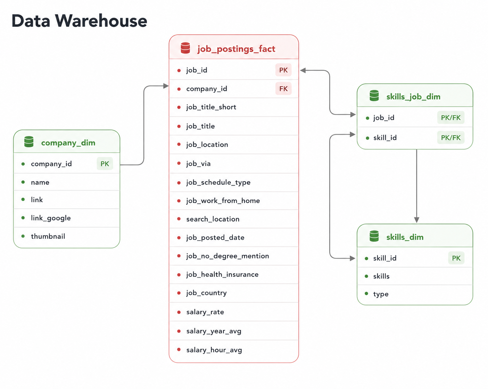

# 🏗️ Job Data Warehouse & Marts



A DuckDB-based ETL pipeline that loads job-posting data from CSVs hosted on Google Cloud Storage into a star-schema warehouse, then builds analytical data marts on top of it.

---

## 🧩 What This Does

Job posting data (title, company, location, salary, remote/degree/health-insurance flags, and associated skills) is distributed as flat CSV files in cloud storage. This pipeline:

1. Loads that data into a normalized star schema (one source of truth)
2. Builds a **flat mart** for quick, denormalized ad-hoc queries
3. Builds a **skills mart** for time-series analysis of skill demand

---

## 🧰 Stack

- **Database:** DuckDB, reading CSVs directly from GCS via `read_csv(...)`
- **Language:** SQL — DDL for schema, DML for load/transform
- **Data model:** Star schema (facts + dimensions), with separate marts built as their own schemas
- **Orchestration:** A single master script (`build_dw_marts.sql`) drives the build via `.read`

---

## 📂 Repository Structure

```text
project/
├── create_tables_dw.sql     # Star schema DDL (warehouse)
├── load_schema_dw.sql       # Loads CSVs from GCS into the warehouse
├── create_flat_mart.sql     # Denormalized flat mart
├── create_skills_mart.sql   # Skills demand mart (time series)
└── build_dw_marts.sql       # Master script — runs the steps above in order
```

---

## 🏗️ Pipeline

### 1. Warehouse



[`create_tables_dw.sql`](./create_tables_dw.sql) defines four core tables:

- `company_dim` — company id + name
- `skills_dim` — skill id, skill name, skill type
- `job_postings_fact` — one row per job posting (title, location, schedule type, remote/degree/health-insurance flags, posted date, salary rate/year/hour)
- `skills_job_dim` — bridge table linking jobs to skills (many-to-many)

[`load_schema_dw.sql`](./load_schema_dw.sql) then populates all four tables straight from CSVs at `https://storage.googleapis.com/sql_de/*.csv` using DuckDB's `read_csv(..., auto_detect=true)`.

**Grain:** one row per job posting in `job_postings_fact`.

### 2. Flat Mart

[`create_flat_mart.sql`](./create_flat_mart.sql) builds `flat_mart.job_postings` — every fact column joined with company name, plus each job's skills rolled up into a single array of `{type, name}` structs (via `array_agg(struct_pack(...))`) so a job's full skill list is available in one row without a separate join.

**Grain:** one row per job posting, all dimensions pre-joined.
**Purpose:** fast ad-hoc querying without needing to know the join graph.

### 3. Skills Mart

[`create_skills_mart.sql`](./create_skills_mart.sql) builds a small dimensional model under the `skills_mart` schema:

- `dim_skill` — skill id, name, type
- `dim_date_month` — one row per month present in the data, with year/month/quarter/quarter name derived via `DATE_TRUNC` and `EXTRACT`
- `fact_skill_demand_monthly` — additive measures per `skill_id + month_start_date + job_title_short`: `postings_count`, `remote_postings_count`, `health_insurance_postings_count`, `no_degree_mention_count`

**Grain:** `skill_id + month_start_date + job_title_short`.
**Purpose:** track skill demand over time; every measure is a count/sum, so it re-aggregates safely at any rollup level.

The script also runs validation queries at the end — row counts for each table and a sample of top skills by posting volume with a computed remote-share ratio.

### 4. Orchestration

[`build_dw_marts.sql`](./build_dw_marts.sql) runs the whole pipeline in order via `.read`:

```bash
duckdb dw_marts.duckdb -c ".read build_dw_marts.sql"
```

---

## 💻 Skills Demonstrated

**ETL & orchestration**
- Direct CSV ingestion from GCS with `read_csv(..., auto_detect=true)` — no manual download step
- Idempotent builds via `DROP SCHEMA/TABLE IF EXISTS`
- Single-command pipeline execution via a master `.read` script

**Dimensional modeling**
- Star schema: `job_postings_fact` against `company_dim` / `skills_dim`, with `skills_job_dim` as the bridge for the many-to-many job↔skill relationship
- A generated date dimension (`dim_date_month`) derived from posting dates rather than loaded from a source file
- Additive fact design in the skills mart so measures roll up cleanly at any grain

**SQL techniques**
- `array_agg` + `struct_pack` to collapse a one-to-many relationship (job → skills) into a single semi-structured column for the flat mart
- CTEs for staging boolean-flag conversions before aggregation
- `DATE_TRUNC('month', ...)` and `EXTRACT(quarter FROM ...)` for time-dimension construction
- `CASE WHEN` logic to turn boolean flags (remote, health insurance, no-degree-mention) into summable 0/1 measures
- `GROUP BY ALL` for concise wide aggregations in the flat mart

**Data validation**
- Row-count checks and sample queries run automatically after the skills mart build to sanity-check the load

---

## 🔭 Possible Next Steps

The pipeline currently covers the warehouse plus two marts (flat and skills). Natural extensions from here include a priority/incremental-update mart (using `MERGE` for upsert-style refreshes) and a company-level hiring-trends mart with bridge tables for company↔location and job-title hierarchies.


# Run this snippet to attach database
ATTACH 'md:_share/dw_marts/ee42cf86-70ff-4051-bcd8-64e2c2a1a151';